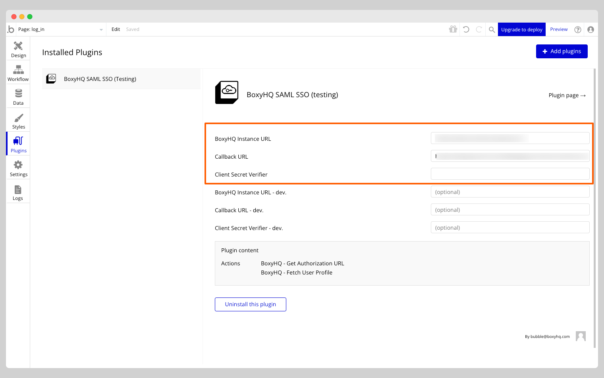
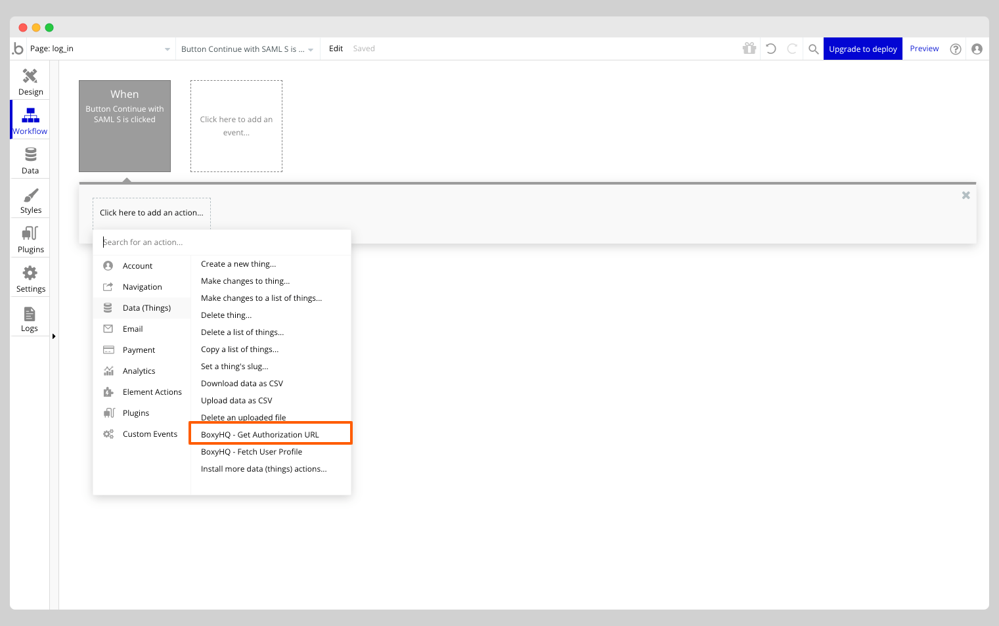
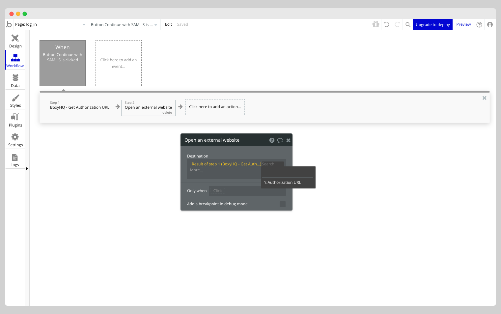
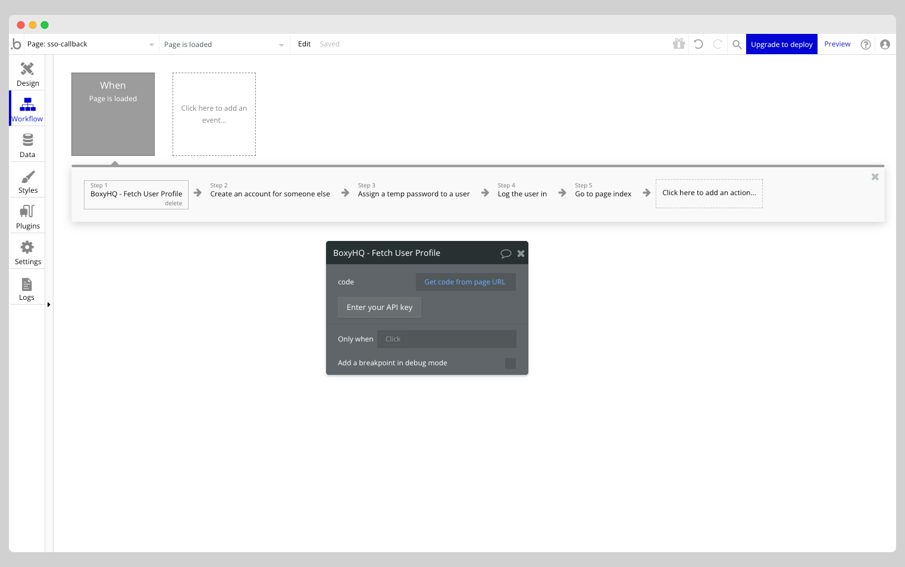
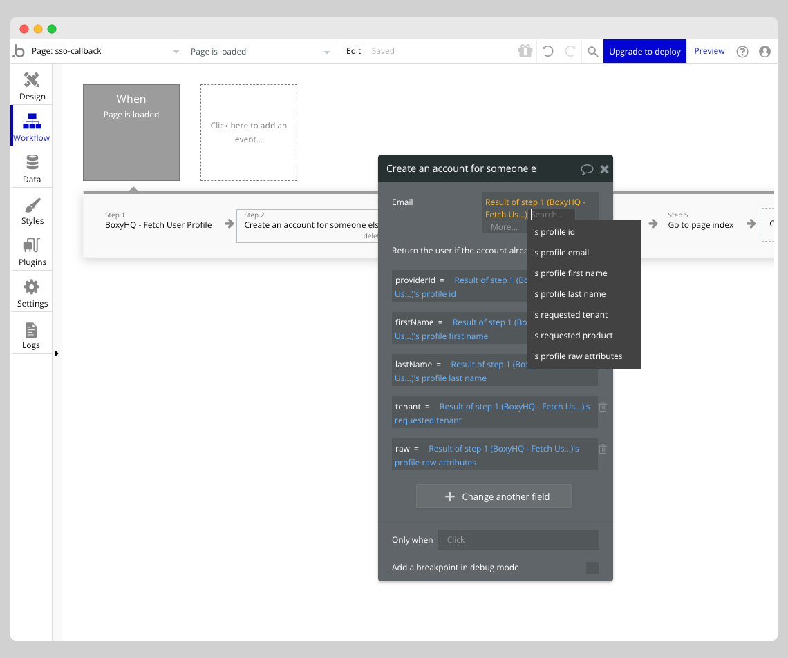

# SAML SSO Bubble插件

本指南将帮助您配置BoxyHQ SAML SSO Bubble插件，为您的Bubble应用添加SAML单点登录认证功能。

目前没有简单的方法能为Bubble应用添加SAML单点登录认证。本插件提供了一种最低成本实现方案。

该插件包含API调用和操作项，用于将Bubble.io应用与BoxyHQ SAML Jackson实例（SaaS版或自托管版）进行SSO认证集成。

请前往[BoxyHQ SaaS平台](https://app.eu.boxyhq.com/auth/join)创建SSO连接以便在插件中使用。您也可以自托管SAML Jackson来使用本插件，具体请参照[SAML Jackson部署指南](https://boxyhq.com/guides/jackson#deployment-guides)进行配置。

可体验[示例Bubble应用](https://boxyhq-saml-sso.bubbleapps.io/version-test)查看插件实际效果。

## 安装插件

通过Bubble编辑器快速安装步骤：

- 从左导航栏进入应用的Plugins选项卡
- 点击右上角**Add plugins**按钮
- 搜索**BoxyHQ SAML SSO**并点击**Install**按钮

## 配置插件

下一步需配置插件参数，请确保在插件设置中添加以下值：

- `BoxyHQ实例URL`：自托管SAML Jackson实例的URL（若使用自托管方案）。否则留空将默认使用我们的托管服务。

- `回调URL`：用户在IdP认证成功后跳转的URL。该URL需与SAML Jackson中配置的SAML连接回调地址一致。

- `客户端密钥校验器`：可选参数。若在SAML Jackson中配置了客户端密钥校验器可在此填写。未配置则留空。

完成上述配置后，即可在应用中设置工作流来使用插件功能。

## 插件操作项

本插件包含以下操作项：

### 获取授权URL

该操作返回用于初始化SAML SSO认证流程的URL。用户通过IdP认证后，将跳转至插件设置中配置的`回调URL`。

### 获取用户资料

该操作返回已认证用户的资料信息。应在用户通过IdP认证并跳转至`回调URL`后使用。

## 设置工作流

从左导航栏进入应用的**Workflows**选项卡，需添加2个工作流：

### 登录工作流

当用户点击应用中的SAML SSO登录按钮时触发此工作流。

从操作列表中选择**BoxyHQ - 获取授权URL**。

在操作中添加以下参数值：

- `tenant`（租户标识符）：多租户企业应用必须将SSO连接关联到租户标识符。例如，应用可以使用以下任意一项作为租户标识符：`domain`（域名）、`organization id`（组织ID）、`team id`（团队ID）或其他唯一标识符。该值将用于从SAML Jackson获取SAML连接。示例：`boxyhq`。

- `product`（产品标识符）：您的应用程序的唯一标识符。该值可在SaaS平台的`Instructions`（使用说明）部分创建`Product`（产品）后获取。若为自托管部署，则此值由您在创建SSO连接时定义。若SAML Jackson仅用于单一产品，该值可为静态值。示例：`my-bubble-app`。

- `state`（状态参数）：用于验证请求状态的随机字符串。该值将通过`Callback URL`（回调URL）回传至您的应用，可用于验证请求的真实性。

此操作将返回`Authorization URL`（授权URL），可用于将用户重定向至身份提供商（IdP）进行认证。

### SSO回调工作流

当用户在IdP完成认证后被重定向回您的应用时，将触发此工作流。

请确保已在应用中创建新页面，并将插件设置中的`Callback URL`配置指向该页面。示例：`https://my-bubble-app.com/sso-callback`。

回调URL将包含以下查询参数：

- `code`：授权码，可用于从SAML Jackson获取用户资料。
- `state`：在`登录工作流`中传递的状态值。

回调URL示例：`https://my-bubble-app.com/sso-callback?code=52d7d591ba2c2e6efa4a8595edf9ac718b3658a7&state=random-state`

:::info
可通过比较查询参数中的`state`值与`登录工作流`传递的`state`值来验证请求真实性。若两者匹配，则可继续从SAML Jackson获取用户资料。

此验证步骤超出本插件范围。若无需验证请求真实性可跳过此步骤，但建议进行验证。
:::

请在`SSO回调工作流`中添加以下操作：

#### 操作：BoxyHQ - 获取用户资料

从操作列表中选择**BoxyHQ - Fetch User Profile**。

在操作中配置以下值：

`code`：查询参数中传递的授权码。可使用动态值`Get data from page URL`获取`code`查询参数的值。

该操作将返回以下值：

- `profile id` - 用户在IdP中的唯一标识符
- `profile email` - 用户的电子邮件地址
- `profile first name` - 用户的名字
- `profile last name` - 用户的姓氏
- `requested tenant` - `登录工作流`中传递的租户标识符
- `requested product` - `登录工作流`中传递的产品标识符
- `profile raw attributes` - IdP返回的原始属性（JSON字符串格式）

#### 操作：为他人创建用户账户

您可以使用**为他人创建用户账户**操作在您的应用中创建新用户账户。若用户不存在，此操作将新建账户；若用户已存在，则更新其账户信息。

请确保在操作中勾选**若账户已存在则返回该用户**复选框。

您可根据需求配置相关参数值。

#### 操作：为用户分配临时密码

Bubble平台要求用户必须设置密码才能登录应用。为解决此限制，我们可为用户账户设置临时密码用于登录。选择**为用户分配临时密码**操作即可设置临时密码。

#### 操作：用户登录

使用**用户登录**操作可使该用户登录您的应用。

在操作中添加以下参数值：

- `邮箱`：用户邮箱地址。可通过动态值`profile email`从`获取用户资料`操作中提取。
- `密码`：为用户账户设置的临时密码。可通过动态值`temp password`从`分配临时密码`操作中提取。

#### 操作：跳转至页面

使用**跳转至页面**操作可将用户重定向至应用内已认证的页面。

## 后续步骤

如有任何问题或需要协助配置，请联系我们的团队，我们将竭诚为您服务！