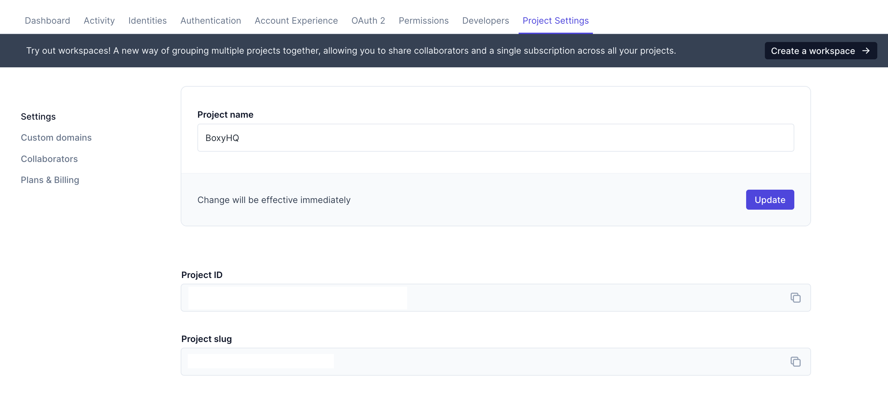
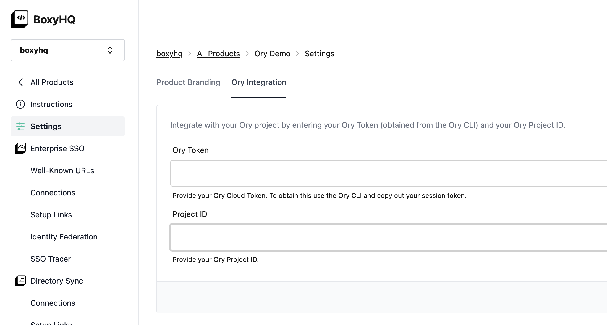
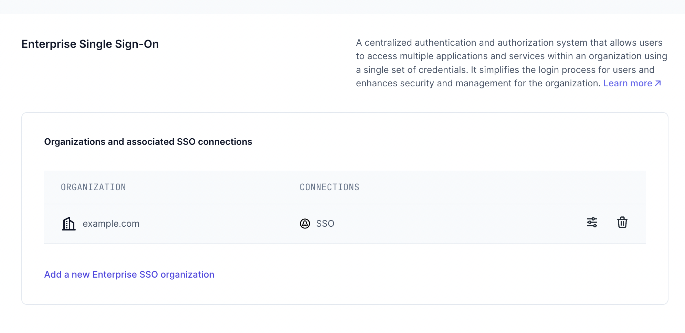
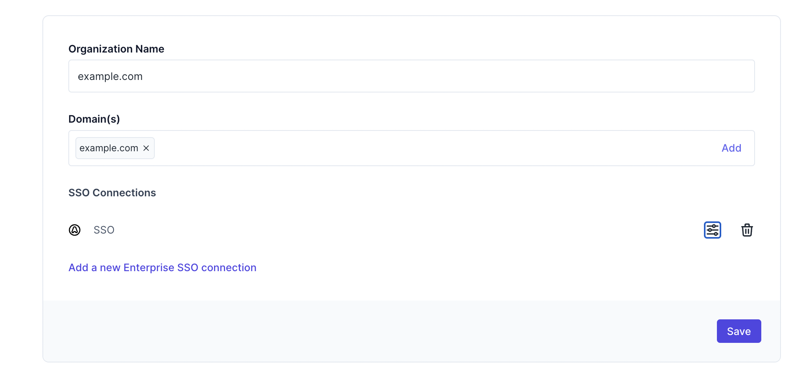

# Ory Network

[Ory Network](https://www.ory.sh/network/) 是一个完全托管的身份基础设施平台，专为成长型团队设计。基于开放标准并由安全专家团队支持，是构建安全认证流程的最快方式。

我们与Ory Network集成以支持SAML单点登录。您可以按照以下步骤操作：

## 部署选项

最简单的集成方式是注册使用我们[SaaS解决方案](https://app.eu.boxyhq.com/auth/join)的30天试用版。如需自托管（Ory集成是企业版功能），请[联系我们](mailto:support@boxyhq.com)获取评估许可证。

请注意，我们使用了Ory Network的"B2B组织"功能，这需要Growth或更高等级的Ory订阅方案。

## 获取Ory Network会话令牌

安装[Ory CLI](https://www.ory.sh/docs/guides/cli/installation)后运行`ory auth`命令登录您的Ory Network账户。

您可以在用户主目录的`.ory-cloud.json`文件中找到以`ory_st`为前缀的`session_token`会话令牌，复制该令牌用于后续步骤。

同时需要从Ory账户中获取您的项目ID。

## 配置Ory会话令牌和项目ID

登录您的BoxyHQ账户，如尚未创建请新建一个"产品"（Product）。我们的"产品"概念与Ory的"项目"（Project）类似。

在侧边栏导航至"设置"→"Ory集成"标签页，将会话令牌和项目ID粘贴至输入框后点击保存按钮。

若采用自托管方案，需设置这些[环境变量](https://boxyhq.com/docs/jackson/deploy/env-variables#enterprise-features---ory-integration)

## 集成原理说明

当您在BoxyHQ上[创建新的SSO连接](https://boxyhq.com/guides/jackson/configuring-saml-sso)时，系统会自动调用Ory API创建新组织和通用OIDC连接。所有用户管理仍通过Ory Network完成，请务必使用域名作为BoxyHQ中的"租户"（tenant）。

此时访问Ory账户体验界面，输入已配置域名关联的邮箱后，将会出现"通过SSO登录"按钮。

## 后续步骤

- 如需集成协助或有任何疑问，请[联系我们](mailto:support@boxyhq.com)